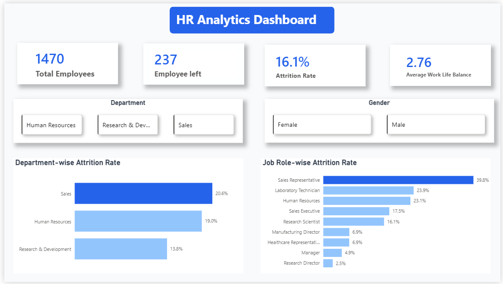
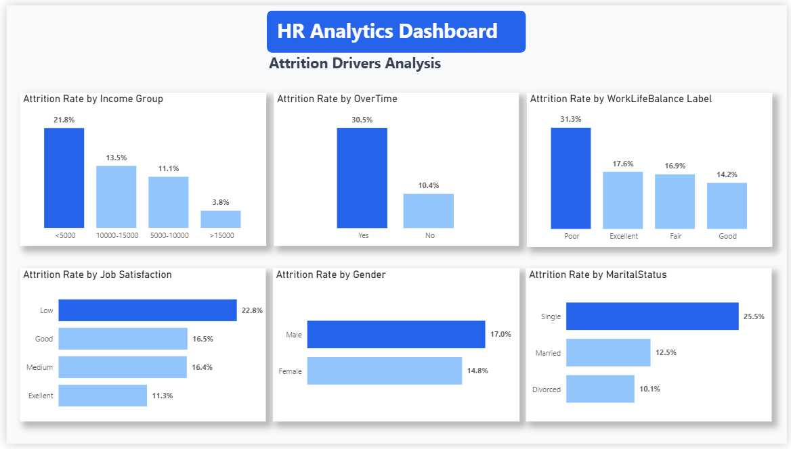

# 📊 HR Analytics Dashboard | Power BI

## 📌 Project Overview

Employee attrition is one of the biggest challenges for HR teams. Simply knowing the overall attrition rate is not enough—organizations need to understand **why employees leave** and **which factors contribute the most to attrition**.

This project analyzes employee attrition using Power BI and DAX by transforming raw HR data into an interactive dashboard that supports HR decision-making.

The dashboard is divided into two analytical pages:

- Executive Overview
- Attrition Drivers Analysis

---

# Dashboard Preview

## Executive Overview



## Attrition Drivers Analysis



---

# Business Problems Solved

This dashboard answers important HR business questions such as:

- What is the overall employee attrition rate?
- Which department experiences the highest attrition?
- Which job roles are most affected?
- Does monthly income influence employee attrition?
- Does overtime increase employee attrition?
- Is poor work-life balance associated with higher attrition?
- Does job satisfaction impact employee retention?
- Is attrition different across genders?
- Which marital status group has the highest attrition?

---

# Dashboard Pages

## 1. Executive Overview

Provides a high-level summary of workforce metrics.

### KPIs

- Total Employees
- Employees Left
- Attrition Rate
- Average Work-Life Balance

### Interactive Filters

- Department
- Gender

### Visualizations

- Department-wise Attrition Rate
- Job Role-wise Attrition Rate

---

## 2. Attrition Drivers Analysis

Focuses on identifying key factors associated with employee attrition.

### Visualizations

- Attrition Rate by Income Group
- Attrition Rate by OverTime
- Attrition Rate by Work-Life Balance
- Attrition Rate by Job Satisfaction
- Attrition Rate by Gender
- Attrition Rate by Marital Status

---

# Key Business Insights

- Employees with monthly income below 5,000 have the highest attrition rate.
- Employees working overtime leave the company significantly more often.
- Poor work-life balance is strongly associated with higher attrition.
- Employees with low job satisfaction are more likely to leave.
- Male employees show a slightly higher attrition rate than female employees.
- Single employees have the highest attrition rate among all marital status groups.

---

# DAX Concepts Used

- Measures
- Calculated Columns
- SWITCH()
- SWITCH(TRUE())
- DIVIDE()
- COUNTROWS()
- CALCULATE()
- Variables (VAR)
- Business KPI Measures

---

# Skills Demonstrated

- Power BI
- Data Modeling
- DAX
- Dashboard Design
- Business Analysis
- HR Analytics
- Data Storytelling
- Interactive Reporting

---

# Project Structure

```
HR-Analytics-PowerBI/
│
├── Dashboard.pbix
├── data/
├── images/
│   ├── executive-overview.png
│   └── attrition-drivers-analysis.png
└── README.md
```

---

# Tools Used

- Power BI Desktop
- DAX
- Power Query

---

# About This Project

This project was built to practice business-oriented dashboard development rather than only creating visualizations. Every chart was designed to answer a specific HR business question and support data-driven decision-making.
